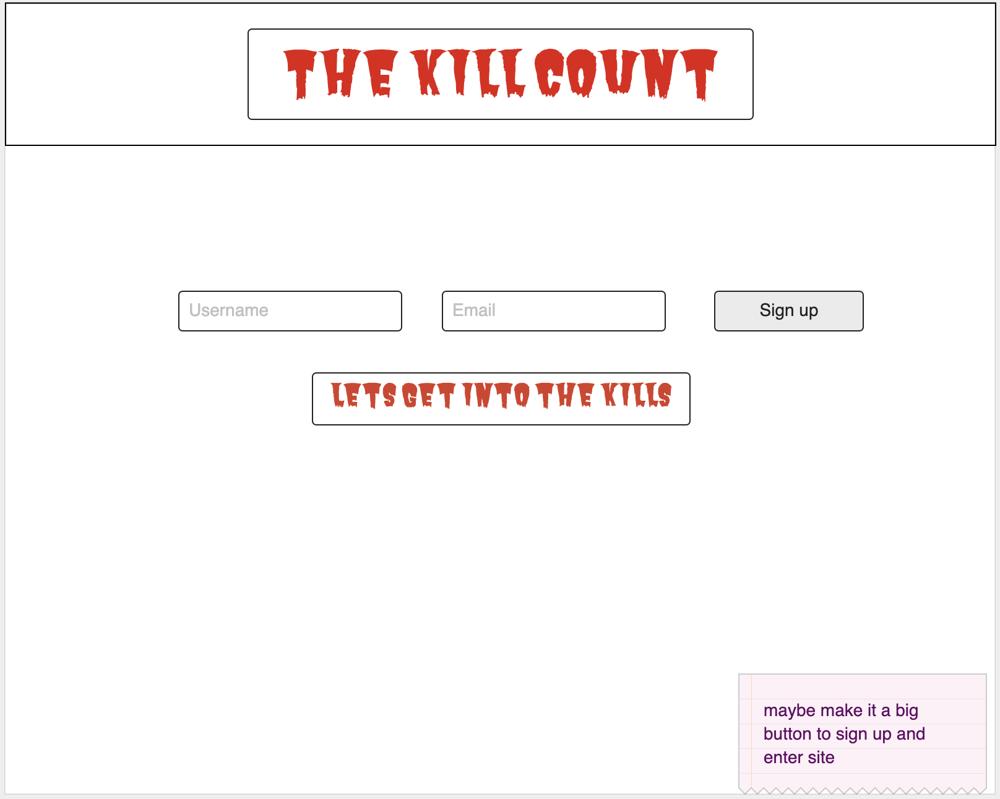
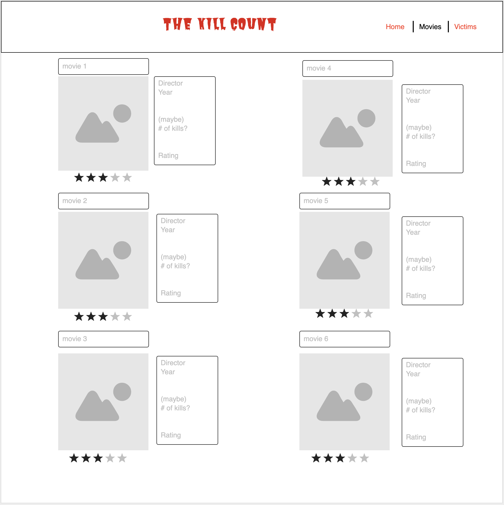
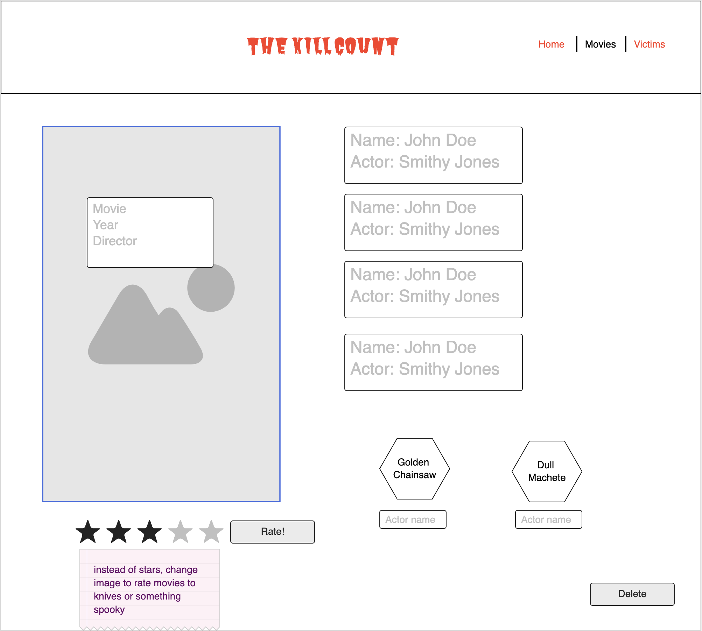
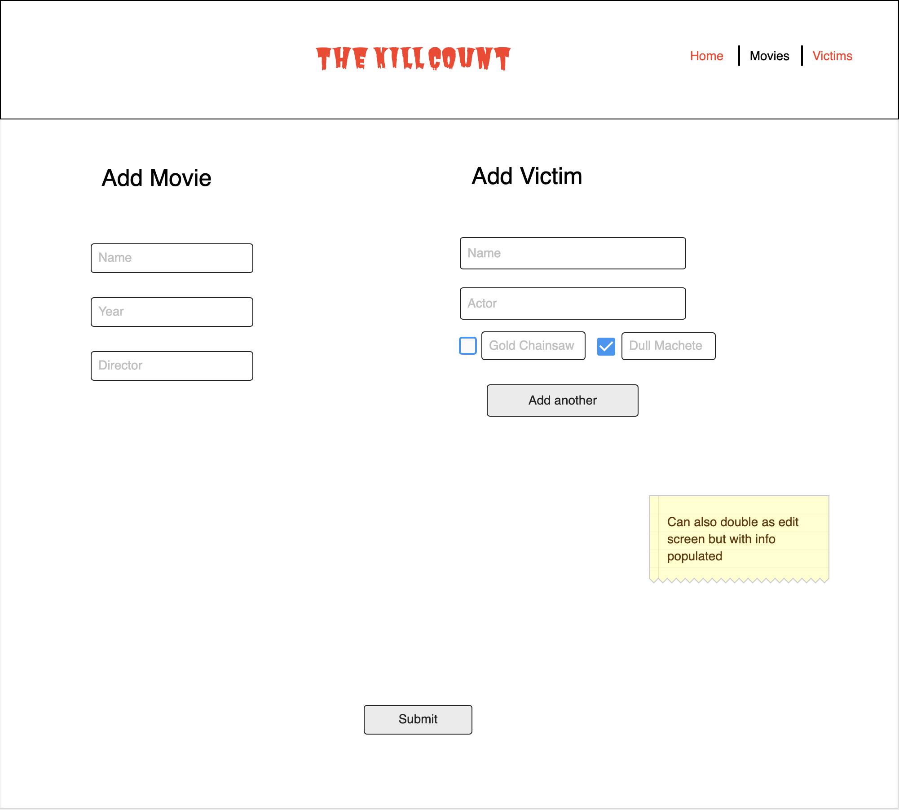
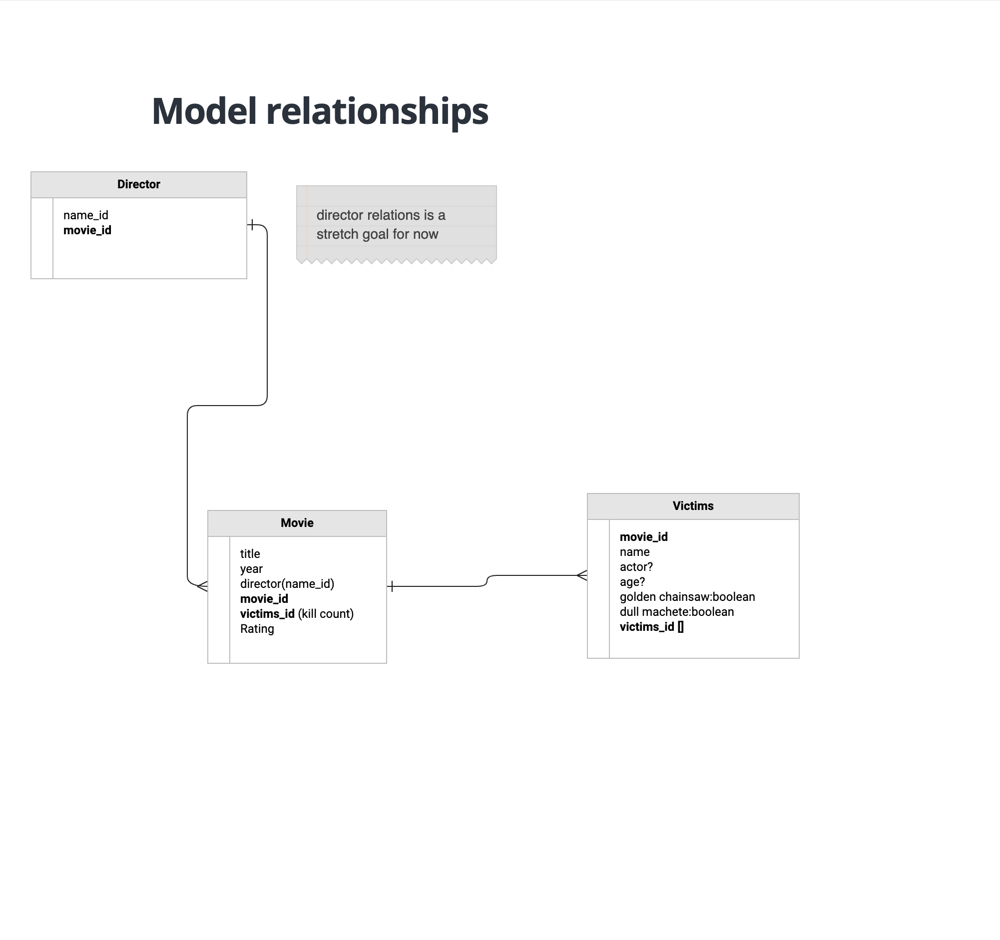

# Project One - Kill Count

Kill Count app is a visual representation of the Dead Meat YouTube channel's Kill Count series. Kill Count is a collection of horror movies and their victims, and is a simple look into scary movies and their victims. 

## User Story

1. As a user, I want to view a collection of scary movies and see who dies in them and how.

2. The user will be taken to an index of movies.

3. Write a route that will take user to the index, create a template which will serve as a gallery of all movie listings.

4. Create schemas for movies and victims, add in a small db of hard-coded movies and victims.

5. Write a route that will take user to a specific movie's detail page. Include victim/kill count info for that movie on this page as well. This page will include edit and delete buttons. Users can delete info right from this page.

6. Create a page where users can edit information about existing movies/victims, create a route that renders current info into forms. Users can edit and submit changes from this page.

7. Create a page where users can add new movies and victims as long as they are signed into the site. 

The landing page will greet the user and will include a nav bar with links to the movie index, the victim index, as well as links to add their own movies/victim profiles to the app.

When a user clicks on a specific movie, they will be taken to that movie's page with more details about the movie, as well as victim "profiles". The victim profiles will display info including the character name, time of death, cause of death, and whether they had the most boring death, or the most interesting death from the movie.

Users will be able to edit existing movies or victims. They will also be able to add movie listings that are not already included in the index.

## Wireframes

## Unsolved/To Do

1. Adding ability to either rate movies or create favorites list/collection for signed in users.
2. Adding the ability to populate all golden chainsaw kills or dull machete kills.
3. Adding the ability for users to upload their own pictures.

## Technologies Used
HTML, CSS, JS, jQuery, Mongoose, EJS, Express (sessions, layouts), MongoDB, bcryptjs, Bootstrap